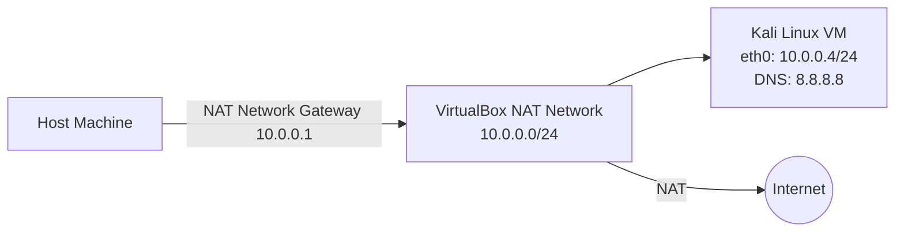

# 🛡️ Isolated Pentest Lab Setup — VirtualBox + Kali Linux (NAT Network)


A documented, reproducible lab setup for building an **isolated, internet-capable Kali Linux environment** using VirtualBox's **NAT Network** feature — completed as part of a cybersecurity internship lab task, with full screenshot evidence for every step.

📄 Full formal write-up: [`Cybersecurity_Lab_Report.docx`](./Cybersecurity_Lab_Report.docx)

---

## 📖 Overview

This repo documents the process of configuring a Kali Linux VM that is:
- **Isolated** from the host machine's physical LAN
- **Still able to reach the internet** for updates, tool installs, and recon practice
- Configured with a **static IP** for predictable, repeatable lab addressing

It also documents a real troubleshooting issue encountered during setup — an adapter reporting "not connected" after IP configuration — and how it was diagnosed and resolved.

---

## 🗺️ Network Architecture



| Parameter | Value |
|---|---|
| Guest OS | Kali Linux 2026.2 (amd64) |
| Network Mode | NAT Network (`NatNetwork`) |
| Subnet | `10.0.0.0/24` |
| Kali IP | `10.0.0.4/24` |
| Gateway | `10.0.0.1` |
| DNS | `8.8.8.8` |
| Promiscuous Mode | Allow All |

---

## ⚙️ Prerequisites

- [Oracle VirtualBox](https://www.virtualbox.org/) installed on host
- [Kali Linux VirtualBox image](https://www.kali.org/get-kali/) (pre-built appliance)
- Host machine with virtualization (VT-x/AMD-V) enabled in BIOS/UEFI

---

## 🚀 Setup Steps

### Step 1 — Open VirtualBox's global network settings
`File → Tools → Network` inside VirtualBox Manager.


### Step 2 — Create the NAT Network
Under **NAT Networks**, create a network (`NatNetwork`) with IPv4 Prefix `10.0.0.0/24` and DHCP enabled at the network level.


### Step 3 — Import the Kali VM
From the VirtualBox Manager home screen, click **Open** to import a pre-built Kali appliance.


### Step 4 — Select the extracted Kali VM folder


### Step 5 — Attach Adapter 1 to the NAT Network
`Kali VM → Settings → Network → Adapter 1 → Attached to: NAT Network → NatNetwork`


### Step 6 — Set Promiscuous Mode and confirm the virtual cable is connected
This checkbox controls the *simulated physical link* of the virtual NIC — see the [Troubleshooting Log](#-troubleshooting-log) below for why this matters.


### Step 7 — Start the Kali VM
Confirm Adapter 1 shows `NAT Network, 'NatNetwork'` before booting.


### Step 8 — Inside Kali, open the network connection editor
Click the network icon → **Edit Connections…**


### Step 9 — Set a static IP, gateway, and DNS
Under **IPv4 Settings**, set Method to **Manual**:
```
Address : 10.0.0.4
Netmask : 24
Gateway : 10.0.0.1
DNS     : 8.8.8.8
```


### Step 10 — Verify the interface
```bash
ip a
```


### Step 11 — Verify internet connectivity (ICMP)
```bash
ping google.com
```


### Step 12 — Verify application-layer connectivity (browser)
Opened Firefox and loaded `fortinet.com` to confirm HTTP/HTTPS traffic, not just ICMP.


Snapshot taken immediately after this working state to preserve a known-good baseline.

---

## 🐛 Troubleshooting Log

### Issue: Network adapter shows "not connected" after applying static IP

**Symptom:** Static IP, gateway, and DNS were all configured correctly, but the interface reported no link / not connected, and all connectivity failed.

**Root Cause:** VirtualBox's per-adapter **"Cable Connected"** setting was unchecked. This operates at the *virtual hardware* level — below the guest OS's network stack — and simulates an unplugged Ethernet cable regardless of how correctly the OS itself is configured.

**Fix:**
1. Shut down the Kali VM.
2. `Settings → Network → Adapter 1`.
3. Check **"Virtual Cable Connected"** (see Step 6 screenshot above).
4. Start the VM.

**Lesson:** When network config looks correct but nothing connects, check the hypervisor's virtual hardware settings before re-checking the OS config — the fault may be a layer below where you're looking.

---

## ✅ Verification Results

| Test | Command / Action | Result |
|---|---|---|
| Interface state | `ip a` | ✅ eth0 `state UP`, `inet 10.0.0.4/24` |
| ICMP reachability | `ping google.com` | ✅ Replies received, 0% loss |
| DNS resolution | Implicit in ping | ✅ Resolved via `8.8.8.8` |
| HTTP/HTTPS traffic | Browser → fortinet.com | ✅ Page loaded fully |
| Environment checkpoint | VirtualBox Snapshot | ✅ Captured |

---

## 📌 Notes / Next Steps

- [ ] Add a second isolated VM (e.g. Metasploitable2) to the same NAT Network for attack/defense practice
- [ ] Revisit Promiscuous Mode (`Allow All`) as a deliberate choice before multi-VM sniffing exercises
- [ ] Document firewall rules once additional VMs are added
- [ ] Add a Host-Only adapter for a management channel isolated from internet-facing traffic

---

## 📁 Repo Structure

```
.
├── README.md
├── Cybersecurity_Lab_Report.docx     # Full formal write-up
└── screenshots/
    ├── 01-open-virtualbox-network-settings.png
    ├── 02-configure-natnetwork-subnet.png
    ├── 03-import-kali-vm-open.png
    ├── 04-select-kali-vm-file.png
    ├── 05-attach-adapter1-to-natnetwork.png
    ├── 06-adapter-cable-connected-promiscuous.png
    ├── 07-start-kali-vm.png
    ├── 08-open-edit-connections-in-kali.png
    ├── 09-set-static-ip-gateway-dns.png
    ├── 10-verify-ip-a.png
    ├── 11-ping-google-success.png
    └── 12-browser-fortinet-success.png
```

---

## 👤 Author

**M. Ali** — [@MAliXCS](https://github.com/MAliXCS)
Cybersecurity Intern at Network-Walks | Documenting hands-on lab work as I go

---

## 📄 License

This repository is provided for educational/documentation purposes. Feel free to fork and adapt for your own lab notes.
